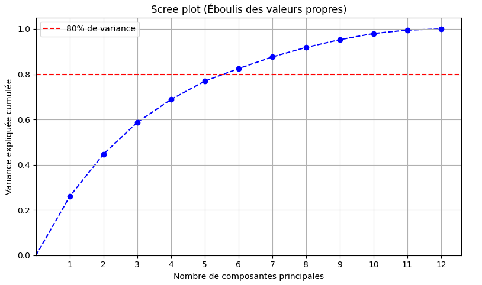
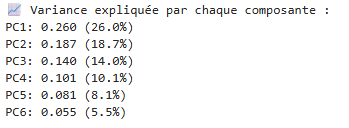
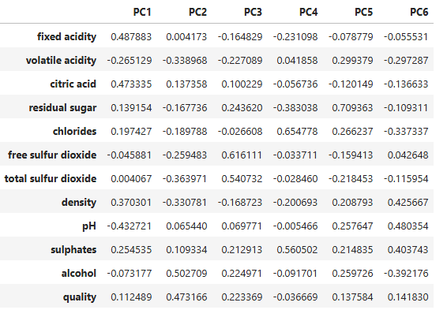
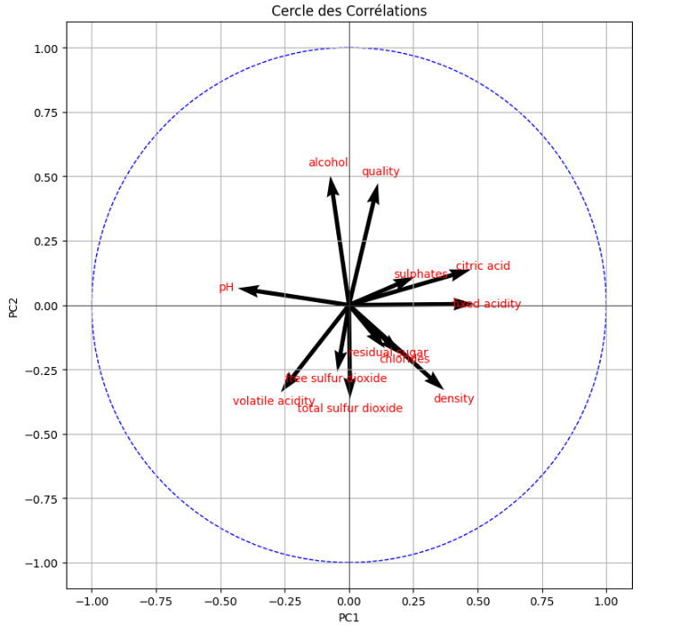

# Réalisation d'une ACP

## Qu'est ce que c'est ? 

L'Analyse en Composantes Principales (ACP) est une méthode statistique de **réduction de dimensionnalité** qui transforme des variables corrélées en un ensemble de variables indépendantes appelées composantes principales.

Son objectif global est de simplifier les données tout en conservant le maximum d'information, facilitant ainsi leur analyse et leur visualisation. 
  
## Quand faire une ACP ?

L’ACP est particulièrement utile lorsque **le nombre de variables quantitatives dépasse un certain seuil** où leur analyse devient difficile, **généralement à partir de 5-10 variables**, mais <u>cela dépend de la corrélation entre elles et de l’objectif d’analyse</u>.

## Comment fonctionne une ACP ? 

L’ACP transforme les variables initiales en un nouvel ensemble de variables appelées **composantes principales**, chacune correspondant à une combinaison linéaire des variables d’origine — autrement dit, chaque composante est construite à partir d’un mélange pondéré des variables de départ, avec des coefficients qui reflètent leur importance.

Ces composantes sont triées par ordre de **variance expliquée** (c’est-à-dire la quantité d’information conservée) : la première composante (PC1) explique le maximum de variance, suivie par la deuxième (PC2), puis la troisième (PC3), etc.

En pratique, on cherche à conserver un nombre de composantes suffisant pour expliquer une part importante de la variance totale. Il n’existe pas de seuil universel, mais voici quelques repères fréquemment utilisés selon le contexte :

| % de variance expliquée | Usage courant                                                             |
| ----------------------- | ------------------------------------------------------------------------- |
| **70 %**                | Minimum acceptable pour des visualisations ou une exploration rapide      |
| **80–90 %**             | Bon compromis entre simplification et fidélité aux données                |
| **> 95 %**              | Rarement nécessaire ; peu utile si l’objectif est de réduire la dimension |

💡 Une bonne pratique consiste à lancer une ACP sur l’ensemble des données dès le départ, puis à observer le **Scree plot** pour déterminer à partir de **combien de composantes principales on dépasse le seuil de variance expliquée que l’on s’est fixé** (par exemple 80 % ou 90 %). Cela permet de choisir objectivement le nombre de dimensions à conserver pour la suite de l’analyse.

Une fois le nombre de composantes principales retenues, l’ACP fournit une matrice de **loadings**, qui contient les **coefficients associés à chaque variable pour chaque composante**. Ces coefficients indiquent dans **quelle direction chaque variable "pèse"** dans la création de chaque axe.
> **Autrement dit, chaque composante principale (PC1, PC2, etc.) est une sorte de nouvelle variable construite à partir d’un mélange pondéré des variables d’origine.**

Les loadings permettent donc d’interpréter ce que représente chaque composante, en identifiant quelles variables y contribuent fortement (positivement ou négativement).

Le cercle des corrélations permet d’interpréter l’influence des variables sur les composantes principales. Chaque variable est représentée par un vecteur dont la direction et la longueur indiquent sa contribution à PC1 (axe X) et PC2 (axe Y). En général, on se limite aux deux premières composantes principales (PC1 et PC2), car elles expliquent la majorité de la variance. Cette approche simplifie la visualisation et rend l’interprétation plus claire, tandis que l’ajout de composantes supplémentaires complique inutilement le graphique.

Quelques interprétations possibles :

- **Proximité d’un axe** : Plus un vecteur est proche d’un axe (PC1, PC2), plus la variable est liée à cette composante.
- **Angle de 90°** : Si deux variables sont à 90°, elles sont non corrélées.
- **Angle aigu** : Un petit angle indique une forte corrélation positive : les deux variables évoluent dans le même sens.
- **Angle proche de 180°** : Un angle proche de 180° signifie une corrélation négative : l’augmentation de l’une entraîne la diminution de l’autre.

# Derniergraphiqueici

## Mise en pratique
### <u>A. Préparation des données</u>
Afin d’obtenir des résultats fiables, il est d’abord nécessaire de nettoyer les données : cela inclut la suppression ou le traitement des valeurs manquantes (NaN) ainsi que la gestion des valeurs aberrantes (outliers), qui peuvent fortement influencer l’analyse.

Ensuite, il est important de ne conserver que les variables quantitatives, l’ACP ne s’appliquant pas aux données qualitatives.

Enfin, il faut standardiser les variables (centrer-réduire), afin qu’elles soient toutes sur la même échelle et que l’ACP ne soit pas biaisée par des différences d’unités ou de grandeurs.

### <u>B. Application de l'ACP</u>

Nous commencons par déterminer le nombres de PC pour notre analyse.

Nous aurons donc 6 PC ! Voici le pourcentage de variance expliquée par chaque groupe en détail :

Nous pouvons donc avoir notre matrice des **Loadings** avec nos coefficient directeur :

### <u>C. Analyse des résultats</u>

## Interprétation

## Retours
- [ ] Pandoc pour exporter en PDF
- [ ] Obsidian ?
- [x] Installer l'extension Markdown All in One
